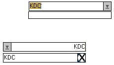



## A \- Flat Combo

### Description

This is very simple flat combobox

vote for this (Back to simple coding)........

it's got almost all of the normal

combobox properties, and more.
 
### More Info
 

             |
---                |---
**Submitted On**   |2001-09-24 19:40:54
**By**             |[KDC](https://github.com/Planet-Source-Code/PSCIndex/blob/master/ByAuthor/kdc.md)
**Level**          |Intermediate
**User Rating**    |4.5 (59 globes from 13 users)
**Compatibility**  |VB 4\.0 \(32\-bit\), VB 5\.0, VB 6\.0
**Category**       |[OLE/ COM/ DCOM/ Active\-X](https://github.com/Planet-Source-Code/PSCIndex/blob/master/ByCategory/ole-com-dcom-active-x__1-29.md)
**World**          |[Visual Basic](https://github.com/Planet-Source-Code/PSCIndex/blob/master/ByWorld/visual-basic.md)
**Archive File**   |[A \- Flat C274501032001\.zip](https://github.com/Planet-Source-Code/kdc-a-flat-combo__1-27762/archive/master.zip)

